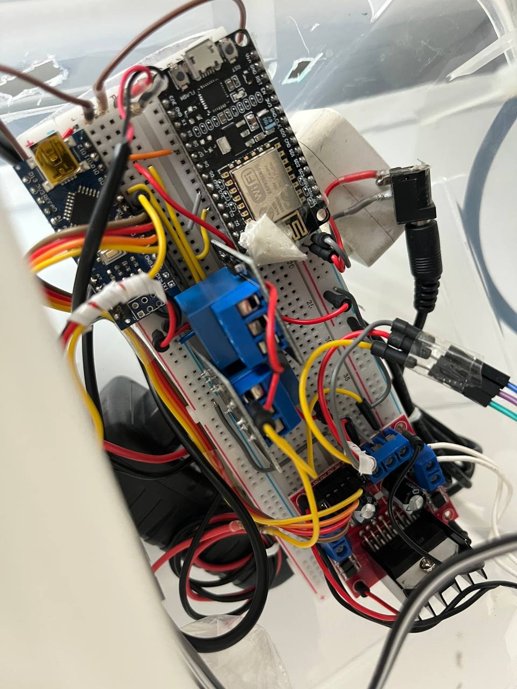

# Remo-te

## Remo-te?
YES! This project aims to build an automated machine for tea brewing! 
Imagine jumping into your car after work and having to drive for quite some time. Wouldn't be great if once you get home a hot cup of freshly brewed tea is waiting for you just at the perfect temperature for you to not burn your tongue? And what if this was just a tap away from your finger?
 
 
Now that's what we are talking about! and you ca find beelow all the documentation that i wrote during the process of making this machine. Take it not as a tutorial but more as an inspiration for your very own version. 
 

## Materials
### for the electronic part we will need
- Arduino nano for hardware driving.
- ESP 8266 or Arduino nano IoT for cloud connection.
- 2 Relays 5Vdc 10A.
- 2 Micro Servo 9g MS18.
- L298N driver for stepper motor.
- Power supply 12v 3A.
- Power supply 5V 1A for autonomus powering the boards, the relais and the servo motors.
- A generic 12V pump and a small pipe.
- A stepper motor, i used 17OM-J349-G2VS Minabea Motor.
- A Breadboard to hold all the components.
- A triple plug to join al the power cables into one plug to be attached to the house power grid.

  
### for the mechanical part we will need
- To print all the .stl files in the "prints" folder
- A water tank to hold the water
- An electrical boiler with auto-shut-off function when boiling point is reached
- A plastic pulley
- A box to hold the circuitry
- About 3 meters of thin fishing line: a piece is used to connect the servo motor which will turn on the boiler and another piece has to be divided in three pieces and braided to make it stronger which will hold the boiler during the pouring process.
- (optional) A bearing to make the twine flow easily
- Of course a teapot to pour te water in!

## Circuit
In the folder "circuit" can be seen the history of the circuits. The last version is this one

The boards are powered autonomously with the 5V 1A power supply.
The pins involved for the Arduino nano are:
- 2,3,4,5 respectively for the first coil (2,3) and the second coil (4,5) of the stepper motor
- 6 controls the servo motor which turns the boiler power on
- 7 controls the power supply relay
- 8 controls the "power router" relay which choses between pump and stepper motor 
- 9 controls the servo motor which starts the falling process
- 10 sends to the ESP board a signal "TE_READY" when the preparation is ended
- RX for serial UART receiver

The pins involved for the ESP are:
- D4 (or GPIO 2) for UART transmission
- D8 (or GPIO 15) for TE_READY signal

this is a photo of my setup.

and a circuit made with fritzing

## Code
The most updated code is the folder, one with 
It provides a series of functions callable from serial communication and allows to test all the functionalities one by one. The code is commented and i think it is pretty easy to understand

## Mechanical building
The assembling process is simple and easily customizable depending on your setting. the only few important rules are 
- the water tank should lay below the boiler otherwise the pump will let the water flow into the boiler
- the circuit board should rest in a place relatively safe from water drops
- the motor should stay in the specific housing in the printed part "remo_te dock.stl"
- the pulley should be attached to the motor and should roll and unroll the fishing line to make the boiler pour the hot water

## Video
Here can be found the demostrating video of the functioning

# Remo-te

